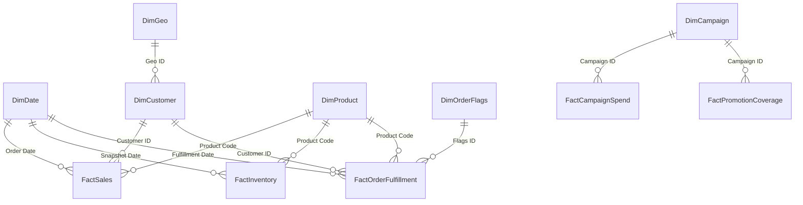

# Omnichannel Sales & Operations (S&OP) Dashboard

<p align="center">
  
  
  
</p>

An enterprise-grade **Omnichannel Sales & Operations Planning (S&OP) Dashboard** built with Microsoft Power BI. This repository leverages the new Power BI Project (`.pbip`) format and Tabular Model Definition Language (TMDL) for standard git-based version control, enabling team collaboration, code reviews, and structured releases.

---

## 📊 Business Overview & Use Case

This dashboard serves as the single source of truth for the **Sales & Operations Planning (S&OP)** team, bridging the gap between demand planning, supply execution, marketing campaigns, and financial performance.

### Core Analytical Focus Areas
*   **Omnichannel Sales Performance:** Analyze sales revenue, margins, and volumes across physical and digital channels. Evaluate performance against dynamic targets.
*   **Inventory Optimization:** Monitor stock levels, stockout risks, and warehouse capacities to prevent operations bottlenecks.
*   **Order Fulfillment & Logistics:** Track On-Time In-Full (OTIF) rates, backorders, returns, and order fulfillment flags.
*   **Marketing & Promotion Coverage:** Measure advertising spend, promotions coverage, and ROI across campaign dimensions.

---

## 🏗️ Technical Architecture & Data Model

The data model is structured as a **Star Schema** to ensure optimal performance in DAX and clear relationships.



### Table Schema Directory

The project consists of the following key dimensions and facts defined in TMDL format:

| Type | Table Name | TMDL Source File | Primary Key / Keys | Business Description |
| :--- | :--- | :--- | :--- | :--- |
| **Dimension** | [`DimCustomer`](file:///d:/courses/Data%20Science/Data%20Engineering/Projects/Omnichannel%20Sales%20&%20Operations%20%28S&OP%29%20Dashboard/S&OP_Dashboard.SemanticModel/definition/tables/DimCustomer.tmdl) | `DimCustomer.tmdl` | `CustomerID` | Consolidates customer profiles, segmentation, and contact information. |
| **Dimension** | [`DimProduct`](file:///d:/courses/Data%20Science/Data%20Engineering/Projects/Omnichannel%20Sales%20&%20Operations%20%28S&OP%29%20Dashboard/S&OP_Dashboard.SemanticModel/definition/tables/DimProduct.tmdl) | `DimProduct.tmdl` | `ProductCode` | Details product names, subcategories, brands, unit prices, and supplier sources. |
| **Dimension** | [`DimDate`](file:///d:/courses/Data%20Science/Data%20Engineering/Projects/Omnichannel%20Sales%20&%20Operations%20%28S&OP%29%20Dashboard/S&OP_Dashboard.SemanticModel/definition/tables/DimDate.tmdl) | `DimDate.tmdl` | `Date` | Standard date reference table optimized for DAX Time Intelligence functions. |
| **Dimension** | [`DimGeo`](file:///d:/courses/Data%20Science/Data%20Engineering/Projects/Omnichannel%20Sales%20&%20Operations%20%28S&OP%29%20Dashboard/S&OP_Dashboard.SemanticModel/definition/tables/DimGeo.tmdl) | `DimGeo.tmdl` | `GeoID` | Contains geographical hierarchies (Cities, Regions). |
| **Dimension** | [`DimOrderFlags`](file:///d:/courses/Data%20Science/Data%20Engineering/Projects/Omnichannel%20Sales%20&%20Operations%20%28S&OP%29%20Dashboard/S&OP_Dashboard.SemanticModel/definition/tables/DimOrderFlags.tmdl) | `DimOrderFlags.tmdl` | `FlagsID` | Diagnoses delayed, cancelled, or returned orders. |
| **Dimension** | [`DimCampaign`](file:///d:/courses/Data%20Science/Data%20Engineering/Projects/Omnichannel%20Sales%20&%20Operations%20%28S&OP%29%20Dashboard/S&OP_Dashboard.SemanticModel/definition/tables/DimCampaign.tmdl) | `DimCampaign.tmdl` | `CampaignID` | Marketing campaign attributes and coverage rules. |
| **Fact** | [`FactSales`](file:///d:/courses/Data%20Science/Data%20Engineering/Projects/Omnichannel%20Sales%20&%20Operations%20%28S&OP%29%20Dashboard/S&OP_Dashboard.SemanticModel/definition/tables/FactSales.tmdl) | `FactSales.tmdl` | `SalesID` (FKs) | Captures sales transactions, quantities sold, revenue, and gross margin details. |
| **Fact** | [`FactInventory`](file:///d:/courses/Data%20Science/Data%20Engineering/Projects/Omnichannel%20Sales%20&%20Operations%20%28S&OP%29%20Dashboard/S&OP_Dashboard.SemanticModel/definition/tables/FactInventory.tmdl) | `FactInventory.tmdl` | `InventoryID` (FKs) | Periodic snapshot of stock levels, warehouse allocations, and unit availability. |
| **Fact** | [`FactOrderFulfillment`](file:///d:/courses/Data%20Science/Data%20Engineering/Projects/Omnichannel%20Sales%20&%20Operations%20%28S&OP%29%20Dashboard/S&OP_Dashboard.SemanticModel/definition/tables/FactOrderFulfillment.tmdl) | `FactOrderFulfillment.tmdl` | `FulfillmentID` (FKs) | Logs scheduled delivery dates vs. actual arrivals, and shipping states. |
| **Fact** | [`FactCampaignSpend`](file:///d:/courses/Data%20Science/Data%20Engineering/Projects/Omnichannel%20Sales%20&%20Operations%20%28S&OP%29%20Dashboard/S&OP_Dashboard.SemanticModel/definition/tables/FactCampaignSpend.tmdl) | `FactCampaignSpend.tmdl` | `CampaignID` (FK) | Records budget expenditures allocated to specific marketing programs. |
| **Fact** | [`FactPromotionCoverage`](file:///d:/courses/Data%20Science/Data%20Engineering/Projects/Omnichannel%20Sales%20&%20Operations%20%28S&OP%29%20Dashboard/S&OP_Dashboard.SemanticModel/definition/tables/FactPromotionCoverage.tmdl) | `FactPromotionCoverage.tmdl` | `CampaignID` (FK) | Measures promotional activities distribution among target markets. |
| **Fact** | [`FactSalesTargets`](file:///d:/courses/Data%20Science/Data%20Engineering/Projects/Omnichannel%20Sales%20&%20Operations%20%28S&OP%29%20Dashboard/S&OP_Dashboard.SemanticModel/definition/tables/FactSalesTargets.tmdl) | `FactSalesTargets.tmdl` | `TargetID` (FK) | Contains organizational sales goals for variance analysis. |

---

## 📁 Repository Structure

This repository uses the Microsoft Power BI Developer Mode format:

```text
├── .github/                      # GitHub Configuration
│   ├── ISSUE_TEMPLATE/           # Interactive YAML Issue Forms
│   │   ├── bug_report.yml
│   │   └── feature_request.yml
│   └── pull_request_template.md  # Standard pull request layout
├── .gitignore                    # Prevents local/cache file commits (e.g. cache.abf)
├── S&OP_Dashboard.pbip           # Power BI Project configuration file (double-click to open)
├── S&OP_Dashboard.Report/        # Layout, visuals, pages, and theme definitions
│   ├── definition.pbir           # Report connection configuration
│   └── StaticResources/          # Icons, themes, background layout assets
└── S&OP_Dashboard.SemanticModel/ # TMDL files defining tables, measures, and relationships
    ├── definition.pbism          # Semantic model metadata settings
    ├── diagramLayout.json        # Relationship visual layout mapping
    └── definition/               # TMDL schemas and expressions files
        ├── database.tmdl
        ├── model.tmdl
        ├── relationships.tmdl
        ├── expressions.tmdl      # Staging M PowerQuery codes
        └── tables/               # Folder containing individual table TMDL schemas
```

---

## 🚀 Getting Started

### Prerequisites
*   **Power BI Desktop** (May 2024 / Version 2.129.x or newer recommended).
*   Ensure **Power BI Project (.pbip)** format and **TMDL** features are enabled in Power BI Desktop options.

### Step 1: Clone the Repository
```bash
git clone <your-repo-url>
cd "Omnichannel Sales & Operations (S&OP) Dashboard"
```

### Step 2: Configure the Data Source Path

> [!WARNING]
> The staging model references an Excel staging file (`dataset.xlsx`) using an absolute hardcoded drive path:
> `D:\courses\Data Science\powerbi-ultimate-course\powerbi-ultimate-course\project_nightmare_datamodel\dataset.xlsx`
>
> To load and refresh the model on your machine, you must modify this data source path.

<details>
<summary><b>🛠️ Option A: Update Path via Power Query Editor (Recommended)</b></summary>

1. Double-click [`S&OP_Dashboard.pbip`](file:///d:/courses/Data%20Science/Data%20Engineering/Projects/Omnichannel%20Sales%20&%20Operations%20%28S&OP%29%20Dashboard/S&OP_Dashboard.pbip) to open the project.
2. In the ribbons tab, go to **Home** > **Transform Data** > **Transform Data**.
3. In the Power Query pane, navigate to the **Queries** panel on the left.
4. Under the `01_Staging` query group, select any query (e.g., `Address`).
5. In the **Applied Steps** list on the right, click the **Gear Icon** next to the `Source` step.
6. Change the file path to point to your local copy of `dataset.xlsx`.
7. Click **Close & Apply** in the top-left corner to refresh the semantic model.
</details>

<details>
<summary><b>💻 Option B: Edit Data Source directly via TMDL code</b></summary>

1. Open [`S&OP_Dashboard.SemanticModel/definition/expressions.tmdl`](file:///d:/courses/Data%20Science/Data%20Engineering/Projects/Omnichannel%20Sales%20&%20Operations%20%28S&OP%29%20Dashboard/S&OP_Dashboard.SemanticModel/definition/expressions.tmdl) in a text editor (e.g. VS Code).
2. Use Find & Replace (`Ctrl + H`) to replace the hardcoded path with your local path:
   *   **Find:** `D:\courses\Data Science\powerbi-ultimate-course\powerbi-ultimate-course\project_nightmare_datamodel\dataset.xlsx`
   *   **Replace with:** `C:\Your\Local\Path\To\dataset.xlsx`
3. Save the file and open the `.pbip` in Power BI Desktop to load the data.
</details>

---

## 📖 Project Documentation & Automation

To support development and business alignment, this repository includes an advanced documentation suite and automated parsing pipeline:

*   **[S&OP Business Workflow Guide](file:///d:/courses/Data%20Science/Data%20Engineering/Projects/Omnichannel%20Sales%20&%20Operations%20%28S&OP%29%20Dashboard/docs/sop_workflow.md):** Connects S&OP planning phases (Demand, Supply, Finance) with specific tables in our model, featuring our modern Draw.io-style architecture flowchart (`docs/images/sop_architecture_final.png`).
*   **[DAX & Modeling Guide](file:///d:/courses/Data%20Science/Data%20Engineering/Projects/Omnichannel%20Sales%20&%20Operations%20%28S&OP%29%20Dashboard/docs/dax_and_modeling.md):** Detailed standards for DAX calculations, including formula templates for our 28 metrics in the `KeyMeasures` table and dynamic disconnected RLS.
*   **[Report & Visualization Design Guide](file:///d:/courses/Data%20Science/Data%20Engineering/Projects/Omnichannel%20Sales%20&%20Operations%20%28S&OP%29%20Dashboard/docs/report_development_guide.md):** Layout templates, visual hierarchies, and color schemes for all 5 core dashboard report pages.
*   **[Automated Data Dictionary](file:///d:/courses/Data%20Science/Data%20Engineering/Projects/Omnichannel%20Sales%20&%20Operations%20%28S&OP%29%20Dashboard/docs/data_dictionary.md):** A structured data catalog listing all tables, fields, data types, and relationships (updated dynamically).

### 🤖 Documentation Automation (CI/CD)
To guarantee that the documentation stays up-to-date with your Power BI model, we created an automated pipeline:
*   **[generate_data_dictionary.py](file:///d:/courses/Data%20Science/Data%20Engineering/Projects/Omnichannel%20Sales%20&%20Operations%20%28S&OP%29%20Dashboard/scripts/generate_data_dictionary.py):** A Python script that scans and parses active `.tmdl` files in `S&OP_Dashboard.SemanticModel` to automatically rebuild the data dictionary.
*   **GitHub Action Pipeline:** A workflow ([`auto_docs.yml`](file:///d:/courses/Data%20Science/Data%20Engineering/Projects/Omnichannel%20Sales%20&%20Operations%20%28S&OP%29%20Dashboard/.github/workflows/auto_docs.yml)) automatically runs the parser script and commits documentation changes whenever updates to database schemas or relationship properties are pushed.

To execute the parser locally:
```bash
python scripts/generate_data_dictionary.py
```

### ⚡ Power BI Modeling MCP Server Integration
This project integrates the official Microsoft **Power BI Modeling MCP Server** at the workspace level.
*   The configuration is saved in `.agents/mcp_config.json`.
*   This server enables AI coding agents (such as Antigravity) to query DAX, edit measures, rename columns, and perform modeling operations directly on the semantic model using natural language via the local PBIP files or a live Desktop/Fabric instance.


---

## 🛠️ Contribution Workflow

Because this project is saved in Developer Mode, changes to DAX measures, columns, table schemas, and visual components are stored as text files (TMDL). This allows you to edit and review code safely.

> [!IMPORTANT]
> **Git Best Practices for Power BI Projects:**
> *   **Do Not Modify `.gitignore`:** Ensure `.pbi/cache.abf` (local data cache) and `.pbi/localSettings.json` are NEVER committed.
> *   **Isolate Changes:** Work in feature branches (`feature/add-otif-measure`) rather than working directly in `main`.
> *   **TMDL Linting:** DAX formulas should be formatted neatly. You can format code using DAX Formatter integrations or standard indentations.
