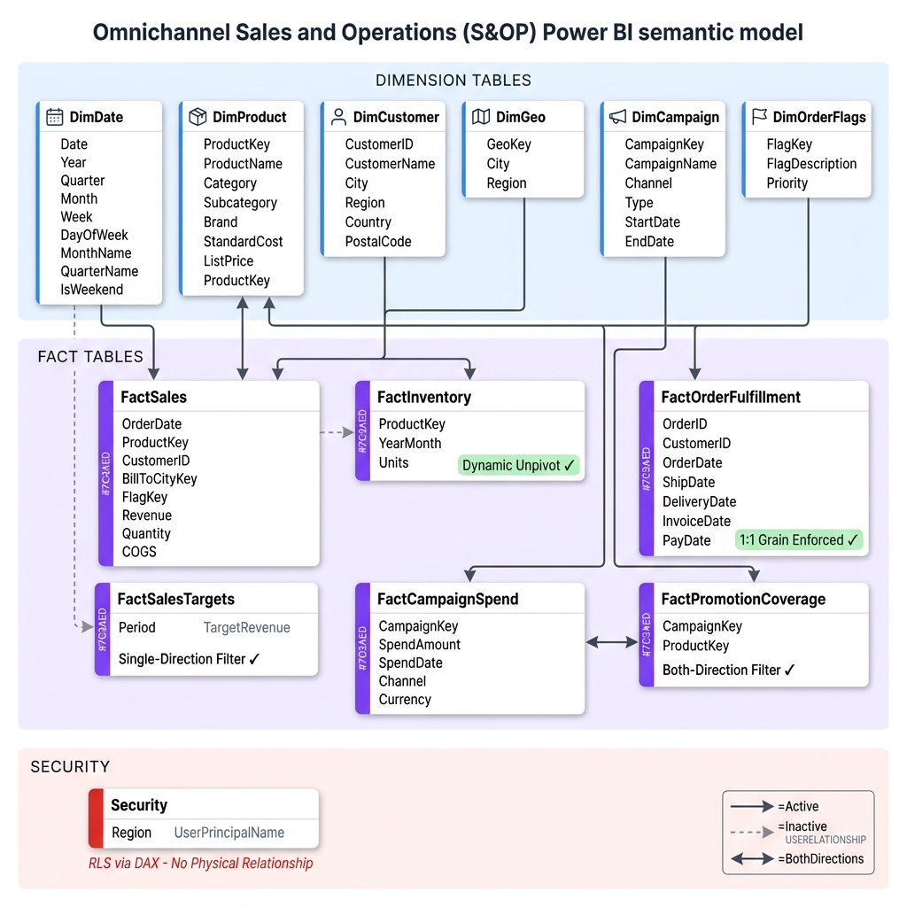

# 🔄 Sales & Operations Planning (S&OP) Business Workflow Guide

This document bridges the gap between technical schemas and business operations. It outlines how each phase of the S&OP process maps to our Power BI data model, enabling coordinators and analysts to drive insights.

---

## 🗺️ Project Data Pipeline

Our S&OP dashboard integrates several data streams (Sales, Inventory, Campaigns, Logistics) to synchronize supply and demand.

---

## 📈 S&OP Cycle Phases & Data Mapping

An effective S&OP cycle operates on a monthly cadence, divided into five main phases. Below is how each phase maps to our model tables.

### 1. Product Review
*   **Business Goal:** Align on product lifecycle changes, new product introductions (NPI), and supplier allocations.
*   **Key Model Tables:**
    *   [`DimProduct`](../S&OP_Dashboard.SemanticModel/definition/tables/DimProduct.tmdl): Identifies brands, subcategories, and primary suppliers.
*   **Analytics Actions:** Review active SKUs, analyze product margins, and flag retired items.

### 2. Demand Review
*   **Business Goal:** Analyze historical sales performance and market trends to establish a consensus demand forecast.
*   **Key Model Tables:**
    *   [`FactSales`](../S&OP_Dashboard.SemanticModel/definition/tables/FactSales.tmdl): Historical actual transactional records (Quantities, LineTotals).
    *   [`FactSalesTargets`](../S&OP_Dashboard.SemanticModel/definition/tables/FactSalesTargets.tmdl): Target sales baselines.
    *   [`DimCustomer`](../S&OP_Dashboard.SemanticModel/definition/tables/DimCustomer.tmdl): Customer segmentation profiles (Corporate, Wholesale, Retail).
    *   [`DimGeo`](../S&OP_Dashboard.SemanticModel/definition/tables/DimGeo.tmdl): Geographic region analytics.
*   **Analytics Actions:**
    *   Calculate **Sales vs. Target Variance %**.
    *   Track customer order frequencies and regional sales velocity.

### 3. Supply Review
*   **Business Goal:** Review inventory availability, warehouse storage constraints, and supplier fulfillment capabilities.
*   **Key Model Tables:**
    *   [`FactInventory`](../S&OP_Dashboard.SemanticModel/definition/tables/FactInventory.tmdl): Snapshot data of warehouse stock status.
    *   [`FactOrderFulfillment`](../S&OP_Dashboard.SemanticModel/definition/tables/FactOrderFulfillment.tmdl): Logistical transaction logs (cancellations, delivery timelines).
    *   [`DimOrderFlags`](../S&OP_Dashboard.SemanticModel/definition/tables/DimOrderFlags.tmdl): Classifications for delays, returns, and damages.
*   **Analytics Actions:**
    *   Assess **Days of Inventory Cover** to prevent stockouts.
    *   Compute **On-Time In-Full (OTIF) %** to measure shipping performance.

### 4. Financial & Marketing Alignment (Reconciliation)
*   **Business Goal:** Evaluate marketing spend, promotional coverage, and customer credit health to match demand plans with financial budgets.
*   **Key Model Tables:**
    *   [`FactCampaignSpend`](../S&OP_Dashboard.SemanticModel/definition/tables/FactCampaignSpend.tmdl): Campaign expenditure logs.
    *   [`FactPromotionCoverage`](../S&OP_Dashboard.SemanticModel/definition/tables/FactPromotionCoverage.tmdl): Marketing campaign reach.
    *   [`DimCampaign`](../S&OP_Dashboard.SemanticModel/definition/tables/DimCampaign.tmdl): Campaign dimensions.
*   **Analytics Actions:**
    *   Compute **Marketing ROI** (Sales Revenue / Campaign Spend).
    *   Audit customer credit utilization against limits.

### 5. Executive S&OP Review
*   **Business Goal:** Senior executives review exceptions, align on key KPI trends, resolve demand-supply gaps, and approve the operating plan.
*   **Key Model Tables:**
    *   Consolidated visualizations on the executive summary report page.
    *   [`Security`](../S&OP_Dashboard.SemanticModel/definition/tables/Security.tmdl): Row-Level Security (RLS) ensuring regional executives only see relevant data.
